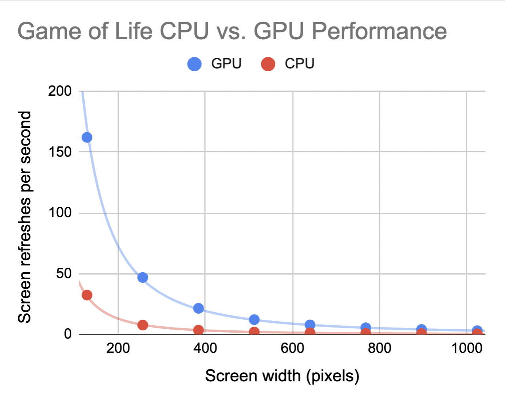

## CAllisto/Icarus TODO: Cellular Automata on the Raspberry Pi GPU
## Team members
Avi Udash and Sarah Chen
## Project description
Our project runs cellular automata simulations on the Raspberry Pi. It supports Conway's Game of Life and WireWorld

We also implemented a user interface to run the simulations. Users can select between types of cellular automata and presets using a button (short press to toggle options, long press to select), and they can start/stop the simulation using a button press too. 

TODO: describe etch-a-sketch

While there are many well-documented approaches to optimizing performance for the game of life, specifically, (often leveraging the fact that there are only two states), we wanted to keep our algorithm adaptable to other automata like WireWorld. Therefore, we sped up the cellular automata by running screen refreshes on the GPU. The approach involved vectorizing the update to handle 16 cell updates at a time (using the QPU's SIMD capabilities). The SIMD implementation is in the QPU assembly file `src/qasm/life_driver.qasm`, which we assembled using [vc4asm](http://maazl.de/project/vc4asm/doc/index.html) and then loaded into our C drivers with an `#include` statement.

The GPU is ~5.95 (stdev = 0.39) times faster than the CPU at all resolutions from 128x128 up to 1024x1024 (see below).

### Components
- Baseline CA simulation library
  - Support Game of Life and WireWorld
  - FAT File System support for reading/writing preset states
- Hardware control board
  - Buttons and interrupts
  - Potentiometers and SPI for analog-to-digital conversion
- Etch-a-sketch functionality to determine preset
- Performance optimization 
  - CPU: Enabled cache, compiled with -O3, fined tuned algorithm using profiler (e.g. comparing modulo for wrapping vs. ternary conditions vs. simple if statements), unrolled update function loop
  - GPU: Vectorized Game of Life on the GPU
## Member contribution
Avi: TODO
Sarah: initial CA simulation library, file system, and performance optimizations

## References

Cite any references/resources that inspired/influenced your project.
If your submission incorporates external contributions such as adopting
someone else's code or circuit into your project, be sure to clearly
delineate what portion of the work was derivative and what portion is
your original work.

Cellular automata library
- Directly used system.h and randomHardware.h
- Our WireWorld implementation referenced [this](https://mathworld.wolfram.com/WireWorld.html) description of the cellular automaton (including the embedded GIF of OR, XOR, and AND gates).
- We used the [FAT Filesystem module](http://elm-chan.org/fsw/ff/00index_e.html), CS107E [guide](http://cs107e.github.io/guides/extras/sd_library/) to FatFS, and the example project at `$CS107E/examples/sd_fatfs` to write code to read and write presets.
- To enable the cache for CPU optimization, we used `system.c` and `system.h` from CS107E code
- We used code from Sarah's profiler extension of assignment 7 to evaluate performance
- http://golly.sourceforge.net/Help/formats.html#rle
  - https://github.com/jimblandy/golly/blob/master/src/Patterns/WireWorld/NylesHeise.mcl
- Reading and writing files to the SD card using [FAT File System](http://elm-chan.org/fsw/ff/00index_e.html), guided by the CS 107E [guide](http://cs107e.github.io/guides/extras/sd_library/)

GPU
- We built directly upon a past CS 107E GPU project, "Bare Metal C QPU Library for the Raspberry Pi" by ahconkey and JoshFrancisCodes [(GitHub)](https://github.com/cs107e/ahconkey-JoshFrancisCodes-project)
    - Before being given access to this code, we did independent research that covered many of their project's references (especially those that heavily informed their code on). 
    - Their code was an invaluable starting point because it was baremetal and interfaced with the CS 107E mailbox code.
    - This code was particularly helpful in demonstrating: how to submit a program to the GPU by directly writing to GPU registers, how to allocate/free/lock memory for the GPU, how to use `#include` to load assembled QPU programs (and in guiding us to use the [vc4asm](http://maazl.de/project/vc4asm/doc/) assembler). We use their `mailbox_functions` and `qpu` modules in their entirety. The `mailbox_functions` module contained a nasty bug that required hours to remove.
    - Note: the code did not compile in its given form, so many adjustments were made. Almost all work hours involving the GPU centered around getting a simple poke program to consistently work by consulting this code as well as well as the below references. (The next steps were working with loading/storing more complicated vectors.)

- Broadcom [VideoCore® IV 3D Architecture Reference Guide](https://docs.broadcom.com/doc/12358545)
  - QPU Register Address Map on p. 37-38
  - Section 7: VPM and VCD (particularly the tables for QPU Registers for VPM and VCD Functions)

- [Hacking The GPU For Fun And Profit](https://rpiplayground.wordpress.com/category/gpu/)
  - Our QPU assembly code was heavily based off of the accompanying [GitHub repository](https://github.com/elorimer/rpi-playground), especially the `helloworld` and `SHA-256` examples.
- [SIMD processing of AES on the Raspberry Pi’s GPU](https://www.mnm-team.org/pub/Fopras/rixe19/PDF-Version/rixe19.pdf)
  - P. 13-17 provide a valuable overview of the GPU, which makes reading the Broadcom Manual much more accessible
- [QPU Demo: DMA Transfers](https://asurati.github.io/wip/post/2021/09/28/qpu-demo-dma-transfers/) breaks down DMA transfers with useful examples. This was helpful in determining how to load/store vector data from main memory to the GPU VPM.
- We consulted code for the existing QPU libraries [GPU_FFT](http://www.aholme.co.uk/GPU_FFT/Main.htm), [QPULib](https://github.com/mn416/QPULib), and [pi-gemm](https://github.com/jetpacapp/pi-gemm/blob/master/helpers.asm). The demo [gpu-deadbeef](https://github.com/0xfaded/gpu-deadbeef) demonstrates how to write to GPU registers to write from QPU registers into the VPM and then from the VPM into main memory.
- General background/inspiration
  - https://github.com/ali1234/vcpoke
  - https://www.linuxtut.com/en/2e85318989170f967e4b/
  - https://www.elesoftrom.com.pl/blog/en/vc4-3d-programming.php#_vpm
  - https://nullprogram.com/blog/2014/06/10/ 
Vectorized game of life

- Our sliding window approach was inspired by [Conway’s Game of Life in R: Or On the Importance of Vectorizing Your R Code](https://www.r-bloggers.com/2018/10/conways-game-of-life-in-r-or-on-the-importance-of-vectorizing-your-r-code/), which built 8 matrices in order to vectorize neighbor calculations and handled edge-cases with zero-padding.

## Self-evaluation

Our team fully executed the plan outlined in the proposal, including the GPU component. We aimed to combine a variety of elements in the hardware and software (e.g. potentiometers, file system, cellular automata, GPU) and successfully gained experience with that spread of topics. 

We had a series of breakthrough moments with the GPU-related aspects of the project: being able to send a simple peek/poke program through the mailbox, understanding the big picture of what was happening, getting the VPM load/store to work, and finally getting a vectorized version of the Game of Life to work for the first time. (The preset we used is burned in my memory.)

We're most proud of the effort we put in and the intense learning that happened along the way. Coming into this, we knew practically nothing about GPUs (other than the fact that they would somehow let us run our simulations faster). The project was a true avalanche of learning in that domain. The process was intimidating but rewarding, and //we were able to get a working product by reading the manual and studying examples of QPU code.//

TODO: Avi
## Photos
TODO
- Menu photo or video
- Random state video 1024x1024
- WireWorld multiplication engine
- Etch-a-sketch video

You are encouraged to submit photos/videos of your project in action.
Add the files and commit to your project repository to include along with your submission.
