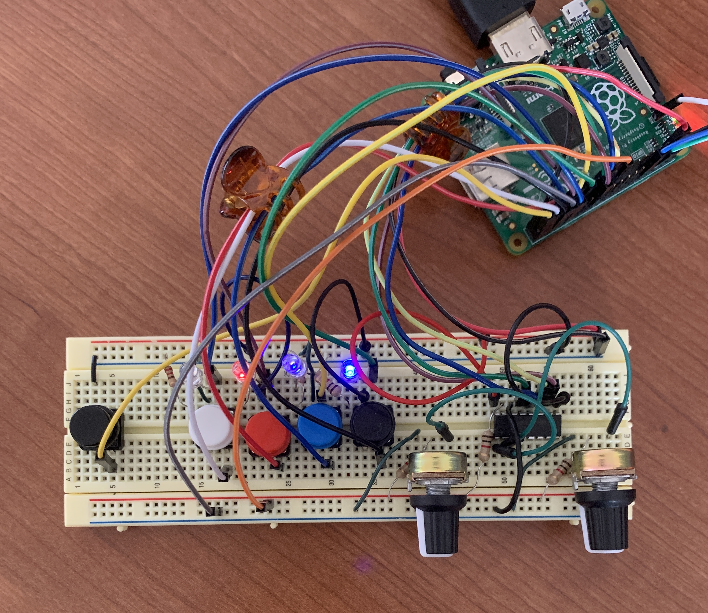
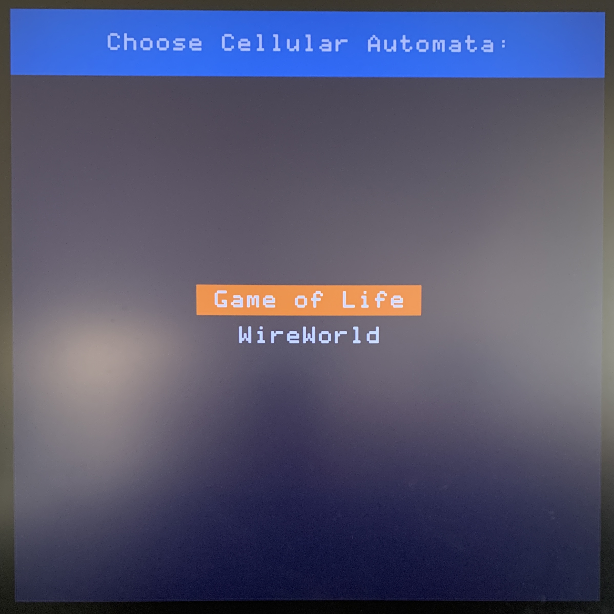
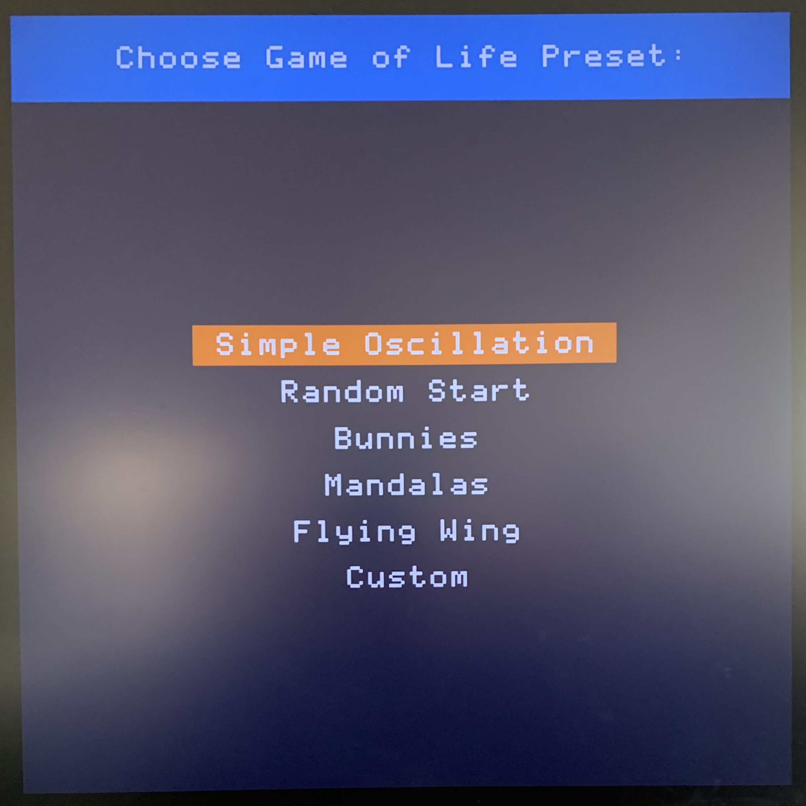

## Cellular Automata on the Raspberry Pi GPU
## Team members
Avi Udash and Sarah Chen

## Project description
Our project runs cellular automata simulations for Conway's Game of Life and WireWorld on the Raspberry Pi's CPU and GPU. The automata are sent to an external display via HDMI, and a hardware user interface allows users to select between types of cellular automata and various preset states (using a short button press to toggle options and a long press to select) as well as to start and stop the simulation. Users can also design a custom start state using two etch-a-sketch style knobs and four buttons that determine the current draw color.

`make run` begins the user interface described above, and we also include a variety of targets for `make test` that test specific modules. 

We sped up the Game of Life by running screen refreshes on the GPU (and the QPU specifically). To do so, we wrote a QPU assembly program (`src/qasm/life_driver.qasm`) that handles individual screen updates by running a sliding window of size 16 over the grid. Since the QPU is a 16-way SIMD processor, this choice of vectorization was a natural step. For each refresh, we sent the assembly code to the GPU and waited for the it to finish updating the framebuffer before resuming the program. For more information about the GPU, see `gpu_guide.md`.

The GPU is ~5.95 (stdev = 0.39) times faster than the CPU at all resolutions from 128x128 up to 1024x1024 (see graph).

Our vectorization process can be adapted to WireWorld (or any other cellular automata) by updating the QPU assembly script to match the automata's rules.

### Components
- Baseline cellular automata simulation library
  - Run Game of Life and WireWorld directly in the double-buffered framebuffer
  - FAT File System support for reading/writing preset states to the SD card
  - RLE-pattern parser, so patterns from websites like "https://conwaylife.com/wiki" can easily be added.
- Hardware control board
  - Buttons and interrupts
  - Potentiometers and SPI with MCP3008 for analog-to-digital conversion
- Etch-a-sketch functionality to create custom preset
  - 2 potentiometers that control X and Y coordinates (with exponential smoothing implemented)
  - Switch which color (state of CA) to draw with, using 4 buttons
- Performance optimization 
  - CPU: Enabled cache, compiled with -O3, fined tuned algorithm using profiler (e.g. comparing modulo for wrapping vs. ternary conditions vs. simple if statements), unrolled update function loop
  - GPU: Vectorized Game of Life on the GPU
## Member contribution
- Avi: hardware controls, etch-a-sketch functionality, menu, and additional CA features
- Sarah: baseline CA simulation library and performance optimizations

## References
Cellular automata library
- Directly used the `system.h` and `randomHardware.h` modules from `$CS107E/src`
- Our WireWorld implementation referenced the [WolframAlpha](https://mathworld.wolfram.com/WireWorld.html) description of the cellular automaton (including the embedded GIF of OR, XOR, and AND gates).
- We used the [FAT Filesystem documentation](http://elm-chan.org/fsw/ff/00index_e.html), CS107E [guide](http://cs107e.github.io/guides/extras/sd_library/) to FatFS, the CS107E `ff.h` module, and the example project at `$CS107E/examples/sd_fatfs` to write code to read and write presets.
- We used code from Sarah's profiler extension of assignment 7 to evaluate cellular automata performance and guide algorithm adjustments
- Presets
  - Implemented a parser for [Golly's Extended RLE]((http://golly.sourceforge.net/Help/formats.html#rle) patterns.
  - We used [Golly Patterns](https://sourceforge.net/p/golly/code/ci/master/tree/Patterns/WireWorld/) for the WireWorld presets of AND gates and Nyles Heise Multiplication engine
  - We used the [Conway Life Wiki](https://conwaylife.com/wiki/) for various the Life presets flying wing, bunnies, and Karel 177 Oscillator 
SPI and MCP3008
- Used the provided SPI library from the `$CS107E/src`
  - Wrote supplemental documentation for using the SPI library with information and page references from the [Broadcom Manual](https://www.raspberrypi.org/app/uploads/2012/02/BCM2835-ARM-Peripherals.pdf)
- Wrote a module to easily use the MCP3008 using the [datasheet](https://cdn-shop.adafruit.com/datasheets/MCP3008.pdf)
- Exponential smoothing implemented with information from the [wikipedia](https://en.wikipedia.org/wiki/Exponential_smoothing)

GPU
- We built directly upon a past CS 107E GPU project, "Bare Metal C QPU Library for the Raspberry Pi" by ahconkey and JoshFrancisCodes [(GitHub)](https://github.com/cs107e/ahconkey-JoshFrancisCodes-project)
    - Before being given access to this code, we did independent research that covered many of their project's references (especially the sources whose code they leaned most heavily on). 
    - Their code was an invaluable starting point because it ran on baremetal and interfaced with the CS 107E mailbox. It was particularly helpful in demonstrating: 
      - How to submit a program to the GPU by directly writing to GPU registers
      - How to allocate/free/lock memory for the GPU using mailbox functions
      - How to use `#include` to load assembled QPU programs (and in guiding us to use the [vc4asm](http://maazl.de/project/vc4asm/doc/) assembler). 
    - We use their `mailbox_functions` and `qpu` modules in their entirety with only small adjustments. However, we will note that their code did not compile in its given form. The `mailbox_functions` module also contained a nasty bug that required hours to remove. Almost all work hours involving the GPU centered around getting a simple poke program to consistently work while building up from this code.
- Broadcom [VideoCore® IV 3D Architecture Reference Guide](https://docs.broadcom.com/doc/12358545)
  - QPU Register Address Map on p. 37-38
  - Section 7: VPM and VCD (particularly the tables for QPU Registers for VPM and VCD Functions)
- [SIMD processing of AES on the Raspberry Pi’s GPU](https://www.mnm-team.org/pub/Fopras/rixe19/PDF-Version/rixe19.pdf)
  - P. 13-17 provide a valuable overview of the GPU, which makes reading the Broadcom Manual much more accessible
- Our vectorized sliding window approach was inspired by [Conway’s Game of Life in R: Or On the Importance of Vectorizing Your R Code](https://www.r-bloggers.com/2018/10/conways-game-of-life-in-r-or-on-the-importance-of-vectorizing-your-r-code/), which built 8 matrices in order to vectorize neighbor calculations and handled edge-cases with zero-padding.
- [Hacking The GPU For Fun And Profit](https://rpiplayground.wordpress.com/category/gpu/)
  - Our QPU assembly code for the Game of Life was heavily based off of the accompanying [GitHub repository](https://github.com/elorimer/rpi-playground), especially the `helloworld` and `SHA-256` examples.
- [QPU Demo: DMA Transfers](https://asurati.github.io/wip/post/2021/09/28/qpu-demo-dma-transfers/) breaks down DMA transfers with useful examples. This was helpful in determining how to load/store vector data from main memory to the GPU VPM (in combination with the reference directly above).
- We consulted code for the existing QPU libraries [GPU_FFT](http://www.aholme.co.uk/GPU_FFT/Main.htm), [QPULib](https://github.com/mn416/QPULib), and [pi-gemm](https://github.com/jetpacapp/pi-gemm/blob/master/helpers.asm). The demo [gpu-deadbeef](https://github.com/0xfaded/gpu-deadbeef) demonstrates how to write to GPU registers to write from QPU registers into the VPM and then from the VPM into main memory.
- General background/inspiration
  - A simple VPU [poke](https://github.com/ali1234/vcpoke) project
  - [GPGPU with Raspberry Pi](https://www.linuxtut.com/en/2e85318989170f967e4b/)
  - [Broadcom VideoCoreIV 3D, Basics of Programming](https://www.elesoftrom.com.pl/blog/en/vc4-3d-programming.php#_vpm)
  - [A GPU Approach to Conway's Game of Life](https://nullprogram.com/blog/2014/06/10/)
  - General info about the Raspberry Pi's GPU from [Herman Hermitage](https://github.com/hermanhermitage/videocoreiv)

## Self-evaluation

Our team fully executed the plan outlined in our proposal, including the GPU optimization component, and we successfully gained experience with a broad spread of hardware and software elements (e.g. potentiometers/SPI, file system, cellular automata, GPU).

We had a series of breakthrough moments with the GPU-related aspects of the project: being able to send a simple peek/poke program through the mailbox, understanding the big picture of what was happening, getting the VPM load/store to work, and finally getting a vectorized version of the Game of Life to work for the first time (after hours of incremental coding, testing, and debugging).

We're most proud of the effort we put in to the project and the intense learning that happened along the way. Coming into this, we knew practically nothing about GPUs (other than the fact that they would somehow let us run our simulations faster), so the project was a true avalanche of learning in that domain. The process was intimidating but rewarding, especially because of how resources around the GPU (e.g. the manual and libraries like GPU_FFT) were somewhat inaccessible to begin with. We learned a lot about debugging in particular: how to wrangle a program that seems quite opaque, take out pieces that seemed to be causing issues, and incrementally add features back in until reaching a final product.

## Photos
The breadboard and hardware controls:

The main menu and Game of Life submenu:

See the video demos in `img/` for real time simulations:
- `life_random.mov`: random preset for Game of Life on 1024 by 1024 screen (running on GPU)
- `ww_multiplication.mov`: Golly preset for WireWorld that 
- `ww_custom.mov`: drawing a custom etch-a-sketch start state with a single wire loop
