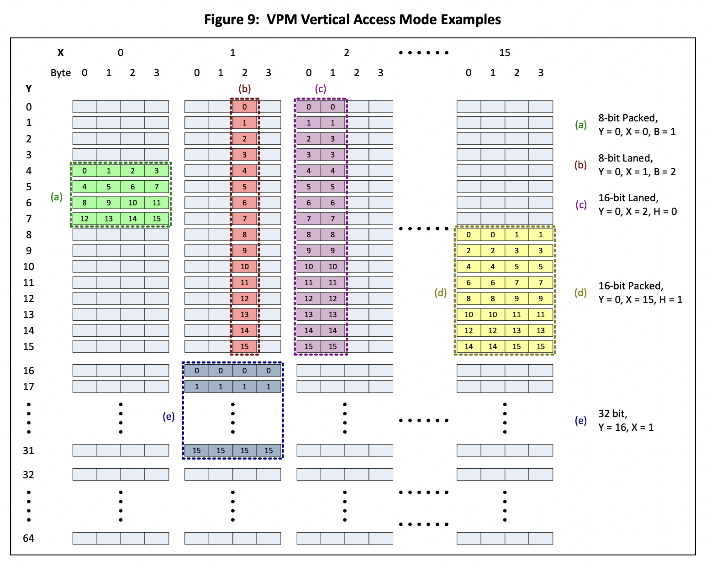

## Notes on the Raspberry Pi's GPU
In addition to the ARM processor, the Raspberry Pi includes a VideoCore IV graphics processing unit (GPU). Our project leveraged the Raspberry Pi's QPUs (3Ds computing cores within the GPU) specifically. The QPU is a 16-way SIMD (single instruction/multiple data) processor, which has two vector ALUs that can perform multiply and non-multiply operations in parallel during a single instruction cycle.

Resources regarding the Raspberry Pi's GPU are somewhat sparse and inaccessible, even after the release of the Videocore IV [manual](https://docs.broadcom.com/doc/12358545). Some sources we found most useful were: 
- [Hacking The GPU For Fun And Profit](https://rpiplayground.wordpress.com/2014/05/03/hacking-the-gpu-for-fun-and-profit-pt-1/) ([code](https://github.com/elorimer/rpi-playground)) - a series of posts describing how to run a parallel algorithm on the QPU from zero to a finished product
- [vc4asm](http://maazl.de/project/vc4asm/doc/index.html) - macro assembler for Broadcom VideoCore IV with information about the QPU assembly instruction set
- [QPU Demo: DMA Transfers](https://asurati.github.io/wip/post/2021/09/28/qpu-demo-dma-transfers/) - explanation of how to use DMA transfers to move data from host memory to GPU memory (the VPM)
- A past CS107E project, "Bare Metal C QPU Library for the Raspberry Pi" by ahconkey and JoshFrancisCodes

We have some examples of GPU code in `gpu_examples/`, and `src/tests/test_gpu.c` contains driver code to run them. The assembly files for `helloworld` and `add_vectors` have more granular information in their line comments.

### Overview of GPU Workflow
To run a program on the GPU, you must send the program to the GPU via the mailbox or by directly poking GPU registers. Three existing modules enabled us to do so:
- `mailbox` (from $CS107E/src) allows us communicate with the GPU through reads, writes, and requests.
- `mailbox_functions` builds upon `mailbox` to support functions like enabling the QPU, allocating/locking/freeing QPU memory, sending code to the VPU/QPU.
- `qpu` builds upon `mailbox_functions` to initialize the QPU, allocate/free memory for the QPU, run a program on the QPU, and modify/read QPU status. 
    - Note that the `qpu_run()` function in specific circumvents the mailbox and directly pokes QPU registers (`V3D_SRQPC`, `V3D_SRQUA`, `V3D_SRQUL`, etc.) to send a program to the QPU. See the past CS107E project's README or the Videocore manual for details. 

Our project built on top of these modules using the following workflow:
- Write QPU assembly files such as those found in `gpu_examples/` to be run on the QPU
    - Vc4asm has useful expressions for registers (e.g. `vpm` for reading and writing to ra48 and rb48)
- Assemble them using [vc4asm](http://maazl.de/project/vc4asm/doc/index.html) with `vc4asm -i vc4.qinc -C FILE.c FILE.qasm`
- Load them into C driver programs using an `unsigned program[] = { #include "FILE.c" };` statement
- Send the code to the GPU using `qpu_run()` and spin until the GPU finishes

General tips
- You must make clean every time you modify the assembly file
- If run into any irregular issues, rebooting should work. However, if your GPU programs consistently require that you reboot the Pi beforehand, something may be wrong with the code (likely involving the mailbox).

### Notes on QPU assembly
- Since the QPU can process one non-mult and one mult instruction per clock cycle, lines of assembly can take the format of `non-mult instr; mult instr` if both fit in a single instruction.
- The QPU has two register files for its memory registers, `ra0...ra31` and `rb0...rb31`. It also has accumulator registers `r0...r5`. 
    - Memory registers cannot be read from directly after they are written to (they require an intervening `nop; nop` line).
    - The multiply and add pipelines can write into two registers in one instruction if the registers are in different register files.
    - You can only read the `a` or `b` register file once in an instruction.
- Branches must be followed by 3 lines of `nop; nop`
- The syntax for ending a QPU program is 
    ```
    nop; thrend;  nop;
    nop;       nop;
    nop;       nop;
    ```

### Passing programs to the QPU
When invoking `qpu_run()`, you must pass a pointer to the assembled code as well as an array of **uniforms**. Uniforms are 32-bit constants that the QPU reads in, FIFO-style, when the assembly file reads from the `unif` register. They are the most straightforward way to transfer a value from the host to the QPU. See the `helloworld` and `vector_add` examples for more information.

Uniforms can specify the address that the GPU should write output to. More specifically, you can allocate and lock some GPU memory, pass in the memory address, and then instruct the GPU to write output vector(s) to that address using DMA transfer (see below). Note that when the GPU writes to the address in examples like `helloworld`, outputs are staggered by 4. We did not run into the same issue when writing directly to the framebuffer. We were not able to determine why this is, and it may be resolvable by changing more of the settings. See `helloworld.qasm` vs. `life_driver.qasm` for more.

Uniforms are not sufficient for working with data, however. To operate on substantial amounts of data, you must load data from host memory to the GPU's Vertex Pipe Memory (VPM), read from the VPM to QPU registers, write from QPU registers to the VPM, and store from the VPM to the host memory.
### Transferring data from main memory to VPM and vice versa
The VPM is a 2D array of 32-bit words accessible by the GPU. It is 16 words wide and a maximum of 64 words in height, and the QPU can read/write to it horizontally or vertically, one vector at a time. See the schematic from the Videocore manual below:



For general-purpose computing, the Vertex Cache DMA (VCD) executes **loads** and **stores** from the main memory to the VPM. The operations are programmed by writing 32-bits to setup registers. 
- `VPMVCD_WR_SETUP` for VPM DMA Store (VDW) basic setup. Accessible as `vw_setup` in vc4asm.
- `VPMVCD_RD_SETUP` for VPM DMA Load (VDR) basic setup. Accessible as `vr_setup` in vc4asm.

Different bit ranges specify parameters such as which rows/columns to read, the number of vectors to process, the orientation (horizontal vs. vertical), etc. See pages 58-59 in the Videocore manual for specifics. The example files contain sample configurations that should suffice for most simple applications. The format for configuration is `ldi vr_setup, IMM` where `IMM` is the desired 32-bit value.

After set up, the QPU can load data from the main memory into the VPM using 
```
or vr_addr, r1, r1;
or rb39, vr_wait, 0; 
```
to load the vector at the address in `r1` and stall until the DMA is complete. (See `add_vectors` example). 

Similarly, it can store data from the VPM to the main memory using 
```
or vw_addr, unif, 0;
or rb39, vw_wait, ra39;
```
### Transferring data from the VPM to QPU registers and vice versa
The GPU can read and write data from the VPM to QPU registers. VPM reads and writes can be configured using the same setup registers as above (`vw_setup` and `vr_setup`), but with different bit specifications in the most significant bits.

Parameters include the number of vectors to read, the orientation (horizational or vertical), start address, element size, and more. Again, see `add_vectors` and the Videocore manul for details (tables 32 and 33 on generic block write and generic block read).

After set up, you can directly read from and write to the `vpm` register as desired.

### Tips and miscellaneous notes
- The parameters here are quite fiddly, and it's difficult to debug GPU assembly code. (One approach can be to have the GPU write to a debug address specified as an additional uniform.) Engler’s theorem of epsilon-steps can save a lot of pain and enable features that would otherwise be impossible
- r4 is read only
- ra39 is no op, which explains why to use `brr ra39, label`, for example, when branching
- Although the mailbox claims that the call to `mailbox_read()` within `mailbox_request()` should return 0 on success, the GPU code seems to run successfully when returning nonzero data values that appear to be legitimate reads.